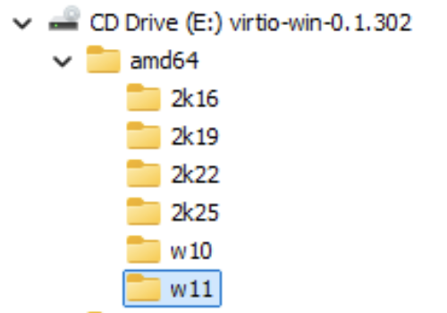
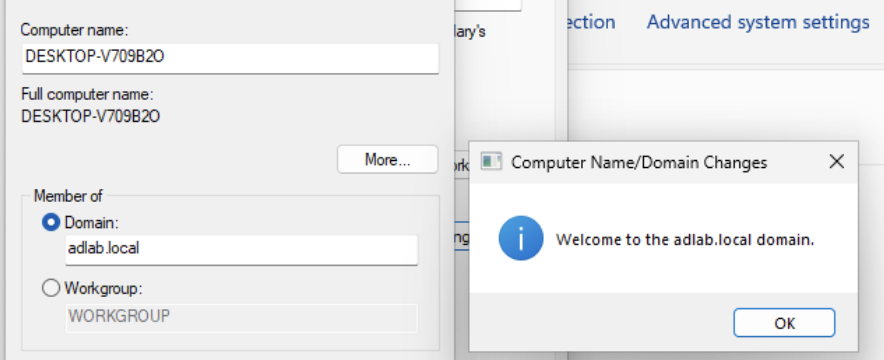

# Windows Domain Client Configuration

## Purpose

The Windows client VM is used to learn and test Active Directory administration tasks, simulating a real user on a physical device.

Client VMs are connected exclusively to the isolated AD lab network (`vmbr1`).

This file is for my reference when setting up a new client VM. Ensure Windows 11 **Pro** is installed, as Home installations cannot join AD Domains.

<br>

# 1. Proxmox VM Configuration

## General/OS

| Setting | Value |
|---|---|
| VM Name | `CLIENTx` (x = client number) |
| OS | Windows 10/11 |

## System

| Setting | Value |
|---|---|
| Machine | `q35` |
| BIOS | `OVMF (UEFI)` |
| EFI Disk | Enabled |
| EFI Storage | `local-lvm` |
| Pre-Enrolled Keys | Enabled |
| TPM | Enabled |
| TPM Version | `2.0` |
| TPM Storage | `local-lvm` |
| SCSI Controller | `VirtIO SCSI single` |
| QEMU Guest Agent | Enabled |

## Disks

| Setting | Value |
|---|---|
| Bus / Device | `SCSI 0` |
| Storage | `local-lvm` |
| Size | `64 GiB` |
| Cache | `Default` |
| Discard | Enabled |
| SSD Emulation | Disabled |
| IO Thread | Enabled |

## CPU

| Setting | Value |
|---|---|
| Sockets | `1` |
| Cores | `2` |
| CPU Type | `host` |

CLIENT01 only requires a small amount of CPU resources because it is being
used as a lightweight lab workstation rather than a production machine.

## Memory

| Setting | Value |
|---|---|
| Memory | `4096 MiB` (4 GiB) |
| Minimum Memory | `4096 MiB` |
| Ballooning | Disabled |

A fixed 4 GiB allocation provides predictable resources for the Windows client without introducing unnecessary memory ballooning.


## Network

| Setting | Value |
|---|---|
| Network Model | `VirtIO (paravirtualized)` |
| Bridge | `vmbr1` |
| Firewall | Default / Disabled |


## 2. Add the VirtIO ISO

In the client VM's "Hardware" tab add CD/DVD Drive.

Then set:
* Bus/Device: IDE1
* Storage: Point to VirtIO .iso file
* Add.


## 3. Boot and setup windows.
Notes:
- Windows 11 Pro
- The drive won't show. Follow these steps:
    - Click `Hardware not showing up?`
    - Click Browse
    - Select the virtio CD Drive
    - Navigate to amd64\w11, click OK.

    <p align="center">
        
    </p>

    - Select `Red Hat VirtIO SCSI pass-through controller`.

## 4. Install VirtIO Network Driver

Windows 11 does not initially have a driver for the VirtIO network adapter provided by Proxmox. Once on the desktop:

1. Open Device Manager.
2. Locate the unrecognised Ethernet Controller under Other devices.
3. Right-click the device and select **Update driver**.
4. Select Browse my computer for drivers.
5. Select the root of the mounted **VirtIO Windows Driver ISO**.
6. Enable Include subfolders.
7. Click **Next** and allow Windows to locate the appropriate driver automatically.

The VirtIO network adapter then appears under **Network adapters** in Device Manager.

## 5. Join CLIENT to the Active Directory Domain

After installing Windows 11 Pro and configuring the VirtIO network driver, CLIENT01 is configured to join the Active Directory domain.

### 5.1 Configure Network

| Setting | Value |
|---|---|
| IP address | `192.168.100.x` |
| Subnet mask | `255.255.255.0` |
| Default gateway | None |
| Preferred DNS | `192.168.100.10` |
| DNS server | DC01 |

DC01 (`192.168.100.10`) is configured as the DNS server because Active Directory relies on DNS to locate domain controllers and other domain services.

### 5.2 Verify Connectivity

Network connectivity is tested from CLIENT01:
```
ping 192.168.100.10
```
DNS resolution is then tested:
```
nslookup adlab.local
```
The domain should resolve to:
```
192.168.100.10
```

The Active Directory LDAP SRV record is also verified:
```
nslookup -type=SRV _ldap._tcp.dc._msdcs.adlab.local
```
This should return `dc01.adlab.local` on port `389`, confirming that the client can locate the domain controller.

### 5.3 Join the Domain

1. Open **Settings -> System -> About**.
2. Open **Advanced system settings**.
3. Select the **Computer Name** tab.
4. Click **Change...**.
5. Select **Domain**.
6. Enter: `adlab.local`
7. When prompted for credentials, enter the domain administrator account: `ADLAB\Administrator`
8. Windows displays the **"Welcome to the adlab.local domain"** message.
9. Restart client to apply the domain membership.

<p align="center">
    
</p>

### 5.4 Verify Domain Authentication

After restarting, select **Other user** at the Windows login screen and use the domain account:

`ADLAB\Administrator`

Successful authentication confirms that the client can communicate with the domain controller and authenticate against the `adlab.local` Active Directory domain.